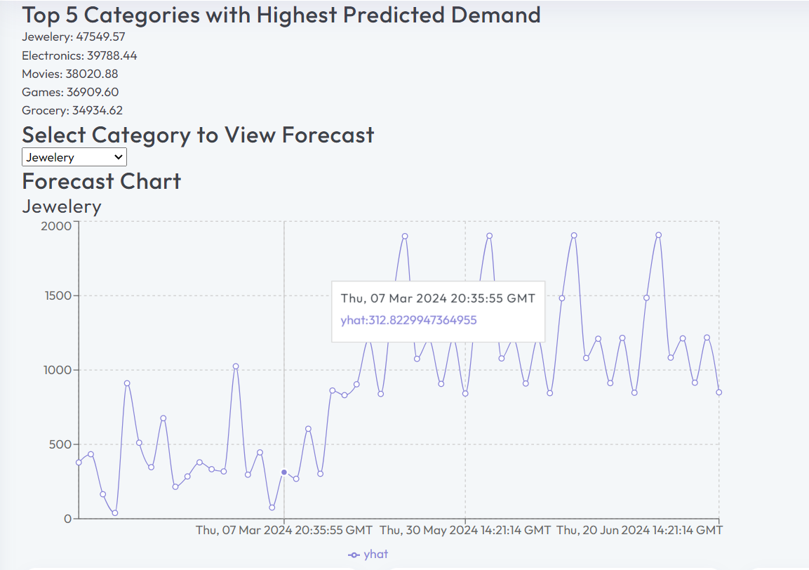
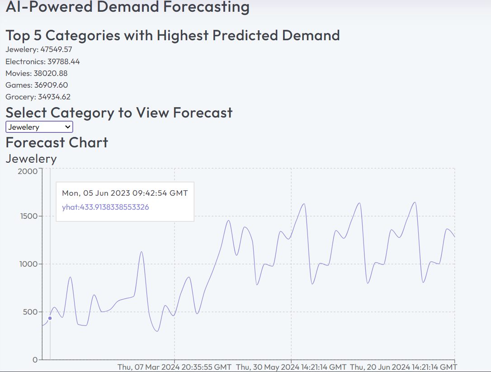
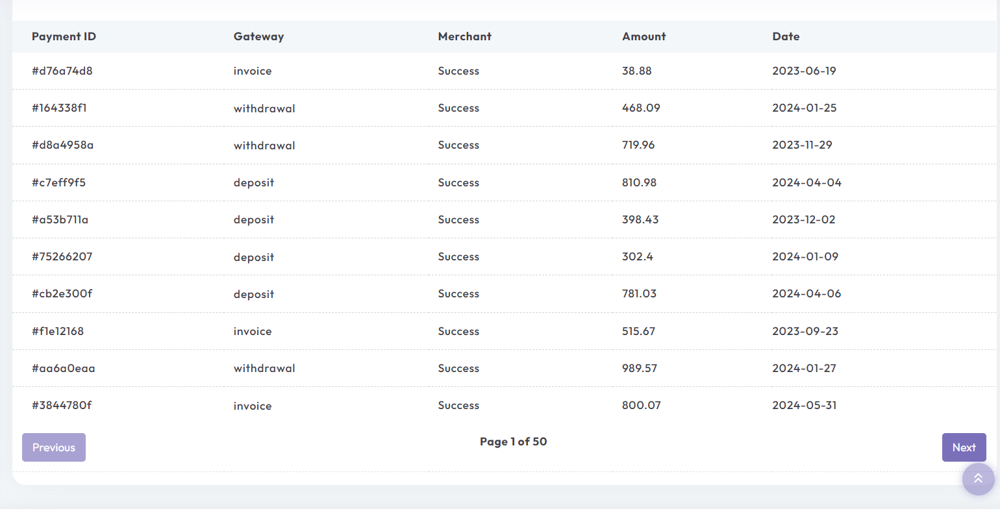
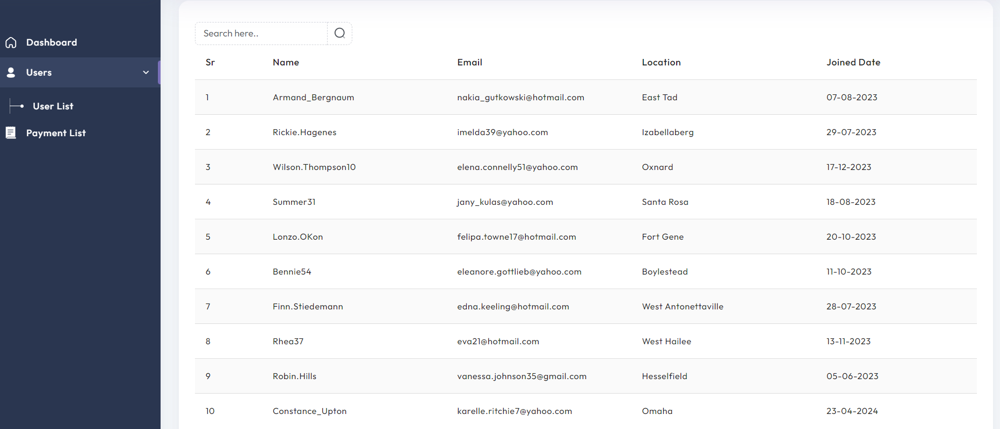
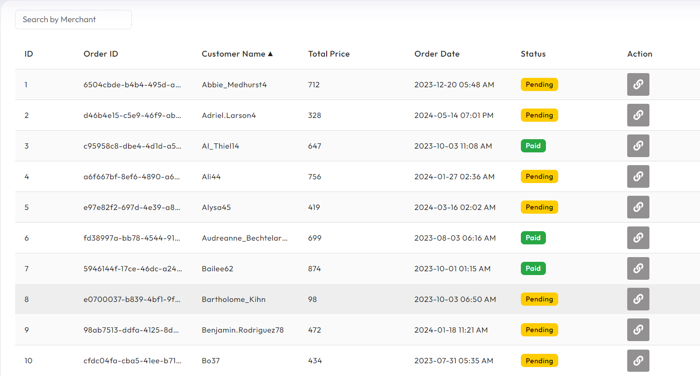
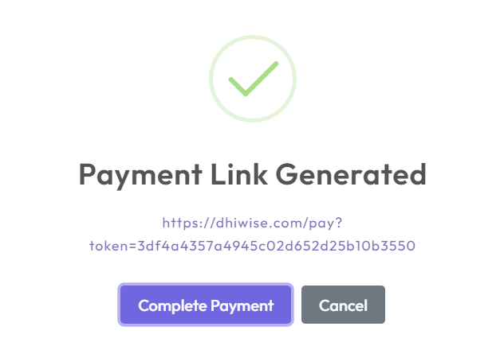
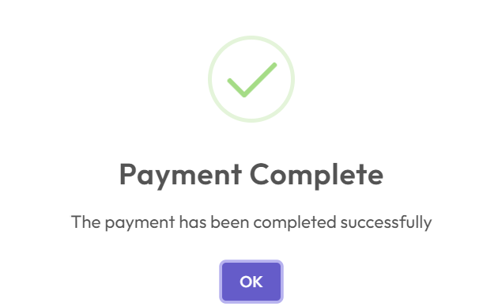
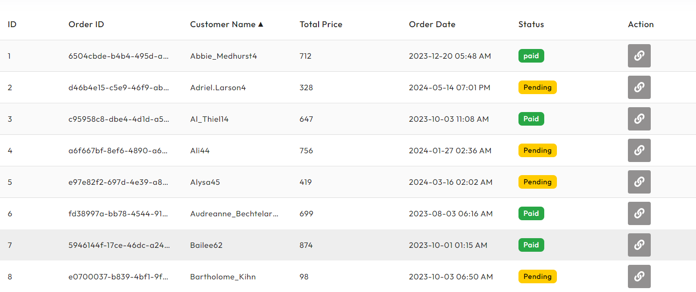

# Advanced-Analytics-Dashboard

## Project Setup

1. Clone the repository:

    ```bash
    git clone https://github.com/jenish77/Advanced-Analytics-Dashboard.git
    ```

2. Navigate to the project directory:

    ```bash
    cd Advanced-Analytics-Dashboard
    ```

3. Install the dependencies:

    ```bash
    for client side to view dashboard
    cd client
    npm install
     
    for the inside server directory 
    cd server 
    npm install 

    for the machine learning model
    cd python-forecasting
    pip install
    ```

4. Start the development server:

    ```bash
    client = npm run dev
    server = npm start
    python-forecasting = pyhton app.py
    ```

5. Open your browser and visit `http://localhost:3000` to view the dashboard.
5. is for nodejs server `http://localhost:7000` to view the dashboard.
5. is for python server `http://localhost:5001` to view the dashboard.

## Description

This project is an advanced analytics dashboard that provides insights and visualizations for data analysis. It utilizes various technologies and libraries to deliver a powerful and user-friendly experience.

## Features

- Interactive charts and graphs
- Transactional Data Reporting
- AI-Powered Demand Forecasting
- Secure Payment Link Generation
- Data filtering and sorting
- Advanced Content Security

## Technologies Used

- nextjs
- Redux
- recharts
- python
- prophet
- faker
- Node.js
- Express
- MongoDB

## AI Forecasting
- this is image show the forecasting result from selected category 



-Below image show the transaction list.


-Below image is total user list


-Below image is for payment list


-Below image is for generate dynamic link for complete the payment


-Below image is for complete the transaction using that link


-after completeing the transaction status would be updated in the payment list



## License

This project is licensed under the MIT License. See the [LICENSE](LICENSE) file for more details.